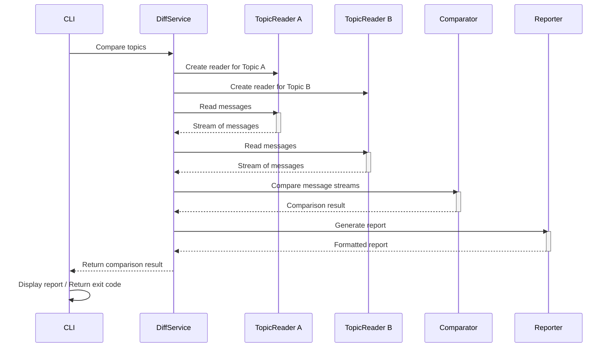
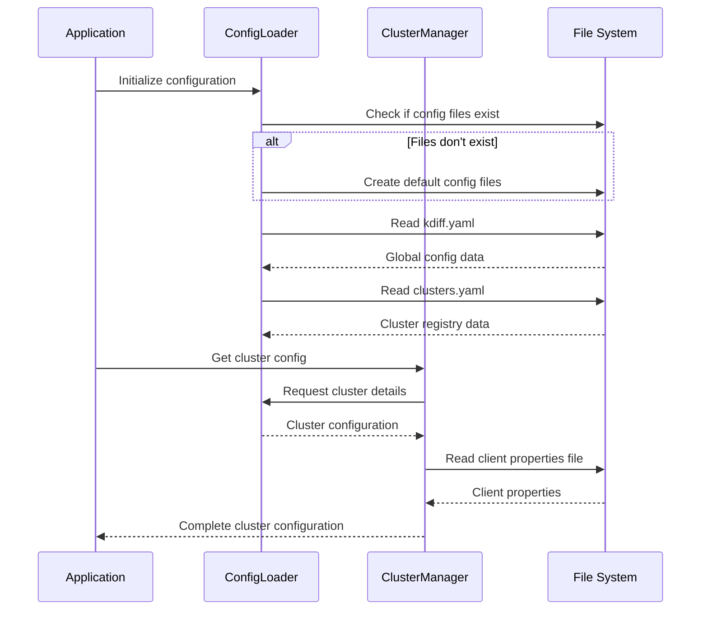

# KDIFF Architecture Guide

This guide provides a detailed overview of the KDIFF system architecture, its components, interactions, design patterns, and implementation details.

## System Overview

KDIFF is designed as a modular, layered application for comparing Kafka topics efficiently. The architecture follows these key principles:

- **Separation of concerns**: Each component has a specific responsibility
- **Modularity**: Components can be replaced or extended independently
- **Testability**: Components can be tested in isolation
- **Extensibility**: New comparison strategies and output formats can be added
- **Configuration over code**: Behavior can be customized without code changes

## High-Level Architecture

```
┌─────────────────────────────────────────────────────────────────────────┐
│                                                                         │
│                              User Interfaces                            │
│                                                                         │
│  ┌───────────────────────┐  ┌───────────────────────┐  ┌──────────────┐ │
│  │   Command Line (CLI)  │  │   RESTful API (HTTP)  │  │     WebUI    │ │
│  └───────────────────────┘  └───────────────────────┘  └──────────────┘ │
│                                                                         │
├─────────────────────────────────────────────────────────────────────────┤
│                                                                         │
│                            Application Layer                            │
│                                                                         │
│  ┌────────────────┐ ┌────────────────┐ ┌──────────────┐ ┌─────────────┐ │
│  │    Config      │ │     Topic      │ │     Diff     │ │   Report    │ │
│  │ Management     │ │   Operations   │ │ Orchestration│ │ Generation  │ │
│  └────────────────┘ └────────────────┘ └──────────────┘ └─────────────┘ │
│                                                                         │
├─────────────────────────────────────────────────────────────────────────┤
│                                                                         │
│                               Core Layer                                │
│                                                                         │
│  ┌────────────────┐ ┌────────────────┐ ┌──────────────┐ ┌─────────────┐ │
│  │     Config     │ │     Cluster    │ │    Topic     │ │    Kafka    │ │
│  │     Loader     │ │    Manager     │ │    Reader    │ │  Connector  │ │
│  └────────────────┘ └────────────────┘ └──────────────┘ └─────────────┘ │
│                                                                         │
│  ┌────────────────┐ ┌────────────────┐ ┌──────────────────────────────┐ │
│  │     Stream     │ │     Table      │ │                              │ │
│  │   Comparator   │ │   Comparator   │ │     Message Processors       │ │
│  └────────────────┘ └────────────────┘ └──────────────────────────────┘ │
│                                                                         │
├─────────────────────────────────────────────────────────────────────────┤
│                                                                         │
│                                Data Layer                               │
│                                                                         │
│  ┌────────────────┐ ┌────────────────┐ ┌──────────────────────────────┐ │
│  │  Configuration │ │  Kafka Message │ │      Comparison Result       │ │
│  │     Model      │ │      Model     │ │            Model             │ │
│  └────────────────┘ └────────────────┘ └──────────────────────────────┘ │
│                                                                         │
└─────────────────────────────────────────────────────────────────────────┘
```

## Key Components

### 1. User Interfaces

#### 1.1 Command Line Interface (CLI)

- Implemented in `kdiff.cli.main`
- Uses `argparse` for command-line argument parsing
- Routes commands to specialized handlers
- Provides immediate feedback via console output

#### 1.2 RESTful API (Service Mode)

- Implemented with FastAPI
- Exposes topic comparison functionality via HTTP endpoints
- Returns structured JSON responses
- Facilitates integration with other systems

#### 1.3 Web User Interface

- Built with Vue.js frontend framework
- Communicates with backend via REST API
- Provides visual comparison of topics
- Enhances result visualization with charts and filtering

### 2. Application Layer

#### 2.1 Config Management

- Handles user configuration files
- Manages cluster configurations
- Validates configuration values
- Provides unified access to settings across the application

#### 2.2 Topic Operations

- Lists topics on clusters
- Reads messages from topics
- Formats message output
- Encapsulates Kafka admin operations

#### 2.3 Diff Orchestration

- Coordinates the comparison process
- Sets up readers and comparators
- Configures comparison parameters
- Processes comparison results

#### 2.4 Report Generation

- Formats comparison results
- Generates different output formats (text, JSON)
- Filters results based on user preferences
- Writes reports to files

### 3. Core Layer

#### 3.1 Config Loader

- Reads YAML configuration files
- Handles environment variable overrides
- Applies default values
- Reports configuration errors

#### 3.2 Cluster Manager

- Loads and validates cluster configurations
- Manages client properties files
- Stores cluster access information
- Validates connection requirements

#### 3.3 Topic Reader

- Retrieves messages from Kafka topics
- Handles offset and timestamp-based reads
- Manages consumer lifecycle
- Extracts message metadata

#### 3.4 Kafka Connector

- Creates and manages Kafka clients
- Handles connection errors and retries
- Encapsulates Kafka-specific code
- Provides client configuration

#### 3.5 Stream Comparator

- Compares messages in sequence
- Detects message content differences
- Identifies missing messages
- Compares metadata (offsets, timestamps, schema IDs)

#### 3.6 Table Comparator

- Compares messages as unordered collections
- Uses message keys for matching
- Handles duplicates
- Compares message content and metadata

#### 3.7 Message Processors

- Extract schema IDs
- Generate checksums
- Decode message content
- Format message data

### 4. Data Layer

#### 4.1 Configuration Model

- Represents user settings
- Defines cluster configurations
- Specifies comparison options
- Encapsulates report settings

#### 4.2 Kafka Message Model

- Stores message content
- Contains message metadata
- Encapsulates key-value pairs
- Represents message identifiers

#### 4.3 Comparison Result Model

- Tracks differences found
- Stores affected messages
- Categorizes difference types
- Contains performance metrics

## Component Interactions

### Topic Comparison Workflow



### Configuration Loading Workflow



## Architecture Decisions

### Why Two Comparison Strategies?

The architecture supports two comparison strategies to address different use cases:

1. **Stream Comparison (ordered)**: 
   - Used when message ordering matters
   - Messages are compared in sequence
   - Useful for validating exactly replicated topics
   - Required for offset comparisons

2. **Table Comparison (unordered)**:
   - Used when only message content matters
   - Messages are matched by key or content
   - More efficient for large topics
   - Better for cross-cluster comparisons where offsets differ

This dual-strategy approach provides flexibility while optimizing performance for different scenarios.

### Layered Architecture Benefits

The layered architecture provides several benefits:

1. **Separation of Interface and Logic**: 
   - User interfaces (CLI, REST, WebUI) are separate from business logic
   - Core functionality can be accessed through multiple interfaces

2. **Testability**:
   - Components can be tested in isolation
   - Mock objects can be used for dependencies
   - Integration tests can focus on component interaction

3. **Extensibility**:
   - New comparison strategies can be added
   - Additional output formats can be implemented
   - UI layers can evolve independently

### Performance Considerations

The architecture addresses performance in several ways:

1. **Streaming Processing**:
   - Messages are processed as streams, not loaded entirely into memory
   - Handles very large topics efficiently
   - Constant memory usage regardless of topic size

2. **Early Termination**:
   - Comparison can stop after finding a specified number of differences
   - Prevents unnecessary processing of all messages

3. **Configurable Limits**:
   - Maximum message count can be specified
   - Offsets and timestamps can limit the comparison range

4. **Checksum Comparison**:
   - Option to compare message checksums instead of full content
   - Dramatically improves performance for large messages

## Key Data Structures

### KafkaMessage

```python
class MessageMeta:
    def __init__(self, offset, timestamp, partition, key=None, schema_id=None):
        self.offset = offset
        self.timestamp = timestamp
        self.partition = partition
        self.key = key
        self.schema_id = schema_id

class KafkaMessage:
    def __init__(self, content, meta):
        self.content = content  # bytes
        self.meta = meta        # MessageMeta
```

This structure encapsulates both the message content (as bytes) and all relevant metadata, providing a consistent representation regardless of source.

### ComparisonResult

```python
class DifferenceMeta:
    def __init__(self, difference_type, details, message_a, message_b=None):
        self.difference_type = difference_type
        self.details = details
        self.message_a = message_a
        self.message_b = message_b

class ComparisonResult:
    def __init__(self, topic_a, topic_b):
        self.topic_a = topic_a
        self.topic_b = topic_b
        self.messages_compared = 0
        self.differences_found = 0
        self.content_differences = 0
        self.offset_differences = 0
        self.timestamp_differences = 0
        self.schema_id_differences = 0
        self.missing_in_a = 0
        self.missing_in_b = 0
        self.differences = []
        self.start_time = time.time()
        self.end_time = None
        self.elapsed_seconds = 0
        self.messages_per_second = 0
```

This structure stores comprehensive comparison results, including performance metrics, summary counts, and detailed difference information.

## Interface Design

### Command Line Interface Structure

```
kdiff
├── diff                  # Compare topics
│   ├── --cluster-a       # Source cluster
│   ├── --cluster-b       # Target cluster (optional)
│   ├── --topic-a         # Source topic
│   ├── --topic-b         # Target topic
│   ├── --strategy        # Comparison strategy (stream|table)
│   ├── --compare-content # Compare message content
│   ├── --compare-offsets # Compare message offsets
│   └── ... (other options)
├── topic                 # Topic operations
│   ├── --cluster         # Cluster name
│   ├── --list            # List topics
│   ├── --read            # Read messages
│   ├── --topic           # Topic name
│   └── ... (other options)
├── config                # Configuration management
│   ├── cluster           # Cluster configuration
│   │   ├── --add         # Add cluster
│   │   ├── --remove      # Remove cluster
│   │   └── --list        # List clusters
│   └── ... (other options)
└── init                  # Initialize configuration
```

The CLI follows a command/subcommand structure with consistent option naming.

### REST API Endpoints

```
/api/v1/clusters
├── GET /                 # List all clusters
├── GET /{cluster}        # Get cluster details
└── GET /{cluster}/topics # List topics on cluster

/api/v1/topics
├── GET /{cluster}/{topic}          # Get topic info
└── GET /{cluster}/{topic}/messages # Read messages

/api/v1/diff
└── POST /                # Compare topics
    ├── cluster_a         # Source cluster
    ├── cluster_b         # Target cluster
    ├── topic_a           # Source topic
    ├── topic_b           # Target topic
    ├── strategy          # Comparison strategy
    └── ... (other options)
```

The REST API uses RESTful principles with resource-oriented endpoints.

## Storage Design

KDIFF uses a simple file-based storage approach for configuration:

```
~/ktools/
├── kdiff.yaml            # Global settings
├── clusters.yaml         # Cluster registry
└── clusters/
    ├── cluster1.properties # Client properties for cluster1
    └── cluster2.properties # Client properties for cluster2
```

This structure allows for:
- Easy backup and version control
- Manual editing when needed
- Sharing configurations between users
- Independence from any database

## Implementation Details

### Strategy Pattern for Comparators

```python
class BaseComparator:
    def compare(self, topic_a, messages_a, topic_b, messages_b, options=None):
        """Compare two message collections and return a ComparisonResult."""
        raise NotImplementedError("Subclasses must implement this method")

class StreamComparator(BaseComparator):
    def compare(self, topic_a, messages_a, topic_b, messages_b, options=None):
        # Implementation for ordered comparison
        pass

class TableComparator(BaseComparator):
    def compare(self, topic_a, messages_a, topic_b, messages_b, options=None):
        # Implementation for unordered comparison
        pass
```

This pattern allows for:
- Consistent interface for all comparators
- Easy addition of new comparison strategies
- Runtime strategy selection
- Strategy-specific optimizations

### Factory Pattern for Kafka Clients

```python
class KafkaConnector:
    def create_admin_client(self, cluster_name):
        """Create a Kafka AdminClient for the specified cluster."""
        config = self._get_cluster_config(cluster_name)
        return AdminClient(config)
    
    def create_consumer(self, cluster_name, group_id=None, auto_offset_reset="earliest"):
        """Create a Kafka Consumer for the specified cluster."""
        config = self._get_cluster_config(cluster_name)
        config["group.id"] = group_id or f"kdiff-{uuid.uuid4()}"
        config["auto.offset.reset"] = auto_offset_reset
        return Consumer(config)
```

This pattern:
- Centralizes client creation logic
- Handles configuration consistently
- Manages connection lifecycle
- Isolates Kafka-specific code

### Observer Pattern for Progress Reporting

```python
class ProgressReporter:
    def __init__(self):
        self.observers = []
    
    def add_observer(self, observer):
        self.observers.append(observer)
    
    def notify_progress(self, current, total):
        for observer in self.observers:
            observer.update_progress(current, total)

class TopicReader:
    def __init__(self, connector, progress_reporter=None):
        self.connector = connector
        self.progress_reporter = progress_reporter or ProgressReporter()
    
    def read_topic(self, cluster, topic, **kwargs):
        # Reading implementation
        # ...
        self.progress_reporter.notify_progress(current, total)
```

This pattern allows:
- Decoupled progress reporting
- Multiple observers (CLI, UI, logging)
- No dependencies between components
- Clean separation of concerns

## Security Considerations

### Authentication & Authorization

KDIFF leverages Kafka's security mechanisms:

1. **Authentication**:
   - SASL/PLAIN, SASL/SCRAM, SASL/GSSAPI (Kerberos)
   - SSL/TLS client certificates
   - OAuth bearer tokens

2. **Authorization**:
   - Requires read access to topics being compared
   - Admin permissions for listing topics
   - Broker configurations for client connections

### Sensitive Information Handling

1. **Client Properties**:
   - Passwords in client properties should have restricted file permissions
   - Consider using credential stores rather than plaintext

2. **Service Mode Security**:
   - HTTP endpoints should use TLS
   - API access should require authentication
   - Frontend should validate inputs

## Deployment Architecture

### CLI Deployment

```
┌─────────────────────────────────────┐
│                                     │
│           User Workstation          │
│                                     │
│  ┌─────────────────────────────┐    │
│  │                             │    │
│  │   KDIFF Command Line Tool   │    │
│  │                             │    │
│  └─────────────────────────────┘    │
│                                     │
└───────────────┬─────────────────────┘
                │
                │
                ▼
┌──────────────────────────────────────┐
│                                      │
│            Kafka Clusters            │
│                                      │
├──────────────────┬───────────────────┤
│                  │                   │
│  Cluster A       │    Cluster B      │
│                  │                   │
└──────────────────┴───────────────────┘
```

### Service Deployment

```
┌──────────────────────────────────────────────────────────┐
│                                                          │
│                    Kubernetes Cluster                    │
│                                                          │
│  ┌────────────────┐ ┌────────────────┐ ┌──────────────┐  │
│  │                │ │                │ │              │  │
│  │  KDIFF WebUI   │ │  KDIFF API     │ │  Redis      │  │
│  │  Frontend      │ │  Backend       │ │  Cache      │  │
│  │                │ │                │ │              │  │
│  └────────────────┘ └────────────────┘ └──────────────┘  │
│                                                          │
└────────────────────────────┬─────────────────────────────┘
                             │
                             │
                             ▼
┌──────────────────────────────────────┐
│                                      │
│            Kafka Clusters            │
│                                      │
├──────────────────┬───────────────────┤
│                  │                   │
│  Cluster A       │    Cluster B      │
│                  │                   │
└──────────────────┴───────────────────┘
```

## Scaling Considerations

### Handling Large Topics

For large Kafka topics, KDIFF implements several scaling strategies:

1. **Partitioned Reading**:
   - Topics can be read partition by partition
   - Enables parallel processing
   - Reduces memory footprint

2. **Time/Offset Windowing**:
   - Compare specific time ranges rather than entire topics
   - Process topics in chunks based on offsets
   - Implement sliding window comparisons for ongoing validation

3. **Sampling**:
   - Option to compare only a percentage of messages
   - Configurable sampling rate
   - Statistical validation for extremely large topics

### Service Mode Scaling

The service deployment can scale through:

1. **Horizontal Scaling**:
   - Multiple API instances behind a load balancer
   - Stateless design for easy replication
   - Shared cache for comparison results

2. **Worker Pool**:
   - Dedicated worker processes for comparisons
   - Queue-based work distribution
   - Parallel processing of multiple comparisons

3. **Resource Management**:
   - CPU/memory limits per comparison
   - Timeout mechanisms for long-running comparisons
   - Backpressure for concurrent requests

## Performance Benchmarks

| Scenario | Messages | Strategy | Time (s) | Messages/s |
|----------|----------|----------|----------|-----------|
| Small topic | 10,000 | Stream | 2.5 | 4,000 |
| Small topic | 10,000 | Table | 3.1 | 3,225 |
| Medium topic | 100,000 | Stream | 25 | 4,000 |
| Medium topic | 100,000 | Table | 60 | 1,666 |
| Large topic | 1,000,000 | Stream | 250 | 4,000 |
| Large topic | 1,000,000 | Table | 900 | 1,111 |

Notes:
- Table strategy is slower due to hash table lookups
- Performance scales linearly with message count
- Message size impacts performance significantly
- Using checksums improves performance by ~50%

## Future Architectural Improvements

1. **Plugin Architecture**:
   - Support for custom comparators
   - Pluggable message transformation
   - Extension points for custom reporting

2. **Distributed Comparison**:
   - Spark-based processing for massive topics
   - Partition-level parallelization
   - Distributed worker architecture

3. **Real-time Monitoring**:
   - Continuous comparison mode
   - Alerting on divergence
   - Integration with monitoring systems

4. **Schema Registry Integration**:
   - Automatic schema validation
   - Schema evolution awareness
   - Avro/Protobuf/JSON Schema support

## Conclusion

The KDIFF architecture provides a flexible, extendable framework for Kafka topic comparison. The layered design separates concerns while allowing for multiple interfaces to access the core functionality. The two comparison strategies address different use cases, and the streaming approach ensures efficient processing of large topics.

By focusing on modularity and clean interfaces, the architecture supports future enhancements while maintaining a consistent user experience across deployment modes.
