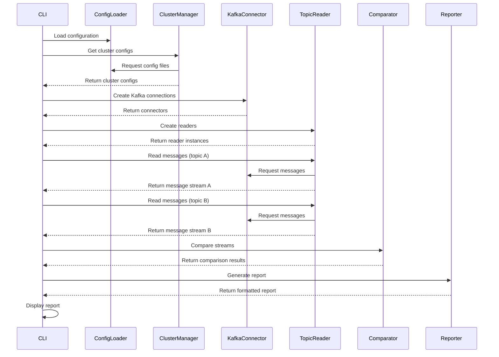

# KDIFF Developer Guide

This guide provides information for developers who want to understand, extend, or contribute to the KDIFF project.

## Architecture Overview

KDIFF consists of several modular components organized into layers:

```
┌─────────────────────────────────────────────┐
│                                             │
│                  CLI Layer                  │
│                                             │
├─────────────────────────────────────────────┤
│                                             │
│                  Core Layer                 │
│                                             │
├─────────────────────────────────┬───────────┤
│                                 │           │
│         Kafka Integration       │  Utility  │
│                                 │           │
└─────────────────────────────────┴───────────┘
```

### Core Components

#### Configuration (`kdiff.core.config`)
- Manages global configuration and cluster definitions
- Handles loading and parsing of configuration files

#### Cluster Management (`kdiff.core.cluster_manager`)
- Manages Kafka cluster configurations
- Provides access to cluster connection details

#### Connector (`kdiff.core.connector`)
- Handles Kafka client creation and connection management
- Abstracts Kafka-specific operations

#### Reader (`kdiff.core.reader`)
- Reads messages from Kafka topics
- Handles offset and timestamp-based reads
- Encapsulates messages in a consistent format

#### Comparator (`kdiff.core.comparator`)
- Implements comparison strategies (stream, table)
- Detects differences between message sets
- Implements different comparison algorithms

#### Reporter (`kdiff.core.reporter`)
- Processes comparison results
- Generates human-readable and machine-readable reports
- Implements filtering and formatting logic

### CLI Components

#### Main CLI (`kdiff.cli.main`)
- Parses command-line arguments
- Routes commands to appropriate handlers
- Handles global options and configuration

#### Topic Commands (`kdiff.cli.topic_commands`)
- Implements topic-related functionality
- Handles listing and reading topics

#### Config Commands (`kdiff.cli.config_commands`)
- Manages configuration operations
- Handles cluster configuration

## Component Interactions

### Comparison Workflow



## Extension Points

KDIFF is designed to be extensible. Here are the key extension points:

### Comparison Strategies

To add a new comparison strategy, extend the base comparator interface:

```python
class BaseComparator:
    def compare(self, topic_a, messages_a, topic_b, messages_b, options=None):
        """
        Compare two message collections and return a ComparisonResult.
        
        Args:
            topic_a: Name of the first topic
            messages_a: Iterator of messages from the first topic
            topic_b: Name of the second topic
            messages_b: Iterator of messages from the second topic
            options: ComparisonOptions object
            
        Returns:
            ComparisonResult object
        """
        raise NotImplementedError("Subclasses must implement this method")
```

Example implementation:

```python
class CustomComparator(BaseComparator):
    def compare(self, topic_a, messages_a, topic_b, messages_b, options=None):
        # Your implementation here
        pass
```

### Report Formats

To add a new report format, extend the DiffReporter class:

```python
def generate_custom_report(self, result: ComparisonResult) -> str:
    """Generate a custom report format."""
    # Your implementation here
    pass
```

Then add the format to the ReportFormat enum and update the generate_report method:

```python
class ReportFormat(Enum):
    TEXT = "text"
    JSON = "json"
    CUSTOM = "custom"

def generate_report(self, result: ComparisonResult) -> str:
    if self.options.format == ReportFormat.JSON:
        return self._generate_json_report(result)
    elif self.options.format == ReportFormat.CUSTOM:
        return self._generate_custom_report(result)
    else:
        return self._generate_text_report(result)
```

## API Reference

### KDiffConfig

```python
class KDiffConfig:
    """Configuration manager for KDIFF."""
    
    def __init__(self, config_dir=None):
        """
        Initialize with optional config directory.
        
        Args:
            config_dir: Path to configuration directory
        """
        
    def get_default_cluster(self) -> str:
        """Get the default cluster name."""
        
    def get_available_clusters(self) -> List[str]:
        """Get a list of available cluster names."""
        
    def get_cluster_config_path(self, cluster_name: str) -> str:
        """
        Get the path to a cluster's configuration file.
        
        Args:
            cluster_name: Name of the cluster
            
        Returns:
            Path to the cluster config file
            
        Raises:
            ConfigError: If the cluster is not configured
        """
        
    def create_default_configs(self) -> None:
        """Create default configuration files."""
```

### KafkaConnector

```python
class KafkaConnector:
    """Handles Kafka connection and client setup."""
    
    def __init__(self, client_config: Dict[str, Any]):
        """
        Initialize with client configuration.
        
        Args:
            client_config: Kafka client configuration
        """
        
    def create_admin_client(self) -> AdminClient:
        """Create a Kafka AdminClient."""
        
    def create_consumer(self, group_id: str = None, 
                       auto_offset_reset: str = "earliest") -> Consumer:
        """
        Create a Kafka Consumer.
        
        Args:
            group_id: Consumer group ID (default: generated)
            auto_offset_reset: Offset reset policy
            
        Returns:
            Kafka Consumer instance
        """
        
    def close(self) -> None:
        """Close all Kafka clients."""
```

### TopicReader

```python
class TopicReader:
    """Reads messages from Kafka topics."""
    
    def __init__(self, connector: KafkaConnector):
        """
        Initialize with a Kafka connector.
        
        Args:
            connector: Kafka connector instance
        """
        
    def list_topics(self) -> List[str]:
        """List available topics."""
        
    def read_messages(self, topic: str, start_offset: int = None, 
                     end_offset: int = None, start_timestamp: int = None, 
                     end_timestamp: int = None, 
                     partitions: List[int] = None, 
                     max_messages: int = None) -> Iterator[KafkaMessage]:
        """
        Read messages from a topic.
        
        Args:
            topic: Topic name
            start_offset: Starting offset (inclusive)
            end_offset: Ending offset (exclusive)
            start_timestamp: Starting timestamp in ms (inclusive)
            end_timestamp: Ending timestamp in ms (exclusive)
            partitions: List of partitions to read from
            max_messages: Maximum number of messages to read
            
        Returns:
            Iterator of KafkaMessage objects
        """
```

### Comparator

```python
class StreamComparator:
    """Comparator for Kafka message streams."""
    
    def __init__(self, options: Optional[ComparisonOptions] = None):
        """
        Initialize with comparison options.
        
        Args:
            options: Comparison options
        """
        
    def compare(self, topic_a: str, messages_a: Iterator[KafkaMessage], 
               topic_b: str, messages_b: Iterator[KafkaMessage], 
               options: Optional[ComparisonOptions] = None) -> ComparisonResult:
        """
        Compare two message streams.
        
        Args:
            topic_a: Name of the first topic
            messages_a: Iterator of messages from the first topic
            topic_b: Name of the second topic
            messages_b: Iterator of messages from the second topic
            options: Override default comparison options
            
        Returns:
            ComparisonResult object
        """
```

```python
class TableComparator:
    """Comparator for Kafka message collections."""
    
    def __init__(self, options: Optional[ComparisonOptions] = None):
        """
        Initialize with comparison options.
        
        Args:
            options: Comparison options
        """
        
    def compare(self, topic_a: str, messages_a: Iterator[KafkaMessage], 
               topic_b: str, messages_b: Iterator[KafkaMessage], 
               options: Optional[ComparisonOptions] = None) -> ComparisonResult:
        """
        Compare two collections of messages as unordered sets.
        
        Args:
            topic_a: Name of the first topic
            messages_a: Iterator of messages from the first topic
            topic_b: Name of the second topic
            messages_b: Iterator of messages from the second topic
            options: Override default comparison options
            
        Returns:
            ComparisonResult object
        """
```

### Reporter

```python
class DiffReporter:
    """Reporter for comparison results."""
    
    def __init__(self, options: Optional[ReportOptions] = None):
        """
        Initialize with report options.
        
        Args:
            options: Report options
        """
        
    def generate_report(self, result: ComparisonResult) -> str:
        """
        Generate a report from comparison results.
        
        Args:
            result: Comparison result object
            
        Returns:
            Formatted report as string
        """
        
    def write_report_to_file(self, result: ComparisonResult, 
                           file_path: str) -> None:
        """
        Write a report to a file.
        
        Args:
            result: Comparison result object
            file_path: Path to write the report to
        """
```

## Development Setup

### Setting up a Development Environment

1. Clone the repository:
   ```bash
   git clone https://github.com/your-org/kdiff.git
   cd kdiff
   ```

2. Create a virtual environment:
   ```bash
   python -m venv venv
   source venv/bin/activate  # On Windows: venv\Scripts\activate
   ```

3. Install in development mode:
   ```bash
   pip install -e ".[dev]"
   ```

### Running Tests

To run the unit tests:

```bash
pytest kdiff/tests/
```

To run with coverage reporting:

```bash
pytest --cov=kdiff kdiff/tests/
```

To run integration tests (requires Docker):

```bash
docker-compose -f docker-compose-test.yml up --build
```

## Code Style Guidelines

KDIFF follows these code style guidelines:

### Python Code Style

- Follow PEP 8 coding standards
- Use 4 spaces for indentation (no tabs)
- Maximum line length of 100 characters
- Use docstrings for all public classes and methods
- Use type hints for function parameters and return values

### Docstring Format

Use Google-style docstrings:

```python
def example_function(param1: str, param2: int) -> bool:
    """
    Short description of function.
    
    Longer description explaining details.
    
    Args:
        param1: Description of param1
        param2: Description of param2
        
    Returns:
        Description of return value
        
    Raises:
        ValueError: When something goes wrong
    """
```

### Import Order

Organize imports in the following order:

1. Standard library imports
2. Related third-party imports
3. Local application/library specific imports

Separate these groups with a blank line.

## Release Process

### Version Numbering

KDIFF uses semantic versioning (MAJOR.MINOR.PATCH):

- MAJOR: Incompatible API changes
- MINOR: Backward-compatible new functionality
- PATCH: Backward-compatible bug fixes

### Creating a Release

1. Update version in `setup.py`
2. Update CHANGELOG.md with release notes
3. Commit changes with message "Bump version to X.Y.Z"
4. Create and push a tag:
   ```bash
   git tag vX.Y.Z
   git push origin vX.Y.Z
   ```
5. Build distribution packages:
   ```bash
   python -m build
   ```
6. Upload to PyPI:
   ```bash
   python -m twine upload dist/*
   ```

## Contributing

### Contribution Workflow

1. Fork the repository
2. Create a feature branch
3. Make your changes
4. Add or update tests
5. Update documentation
6. Submit a pull request

### Pull Request Guidelines

- Include tests for new functionality
- Update documentation as needed
- Follow the code style guidelines
- Write clear commit messages
- Reference issue numbers in commit messages
