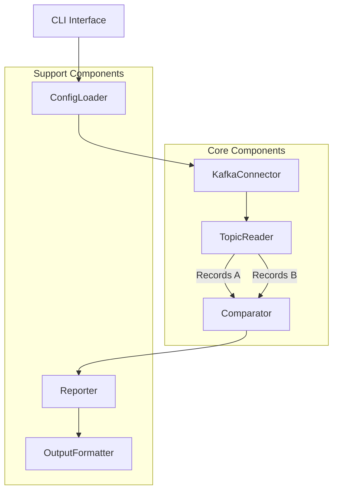

# KDIFF TOOL: INTERFACE & ARCHITECTURE PROPOSAL

## SITUATION ANALYSIS

- **Core problem**: Verify data consistency between two Kafka topics without file dumps
- **Key constraints**: 
  - Must handle binary-level comparison 
  - Must work directly with streams/tables
  - Must be configurable for different clusters
- **Critical variables**:
  - Message content equality (mandatory)
  - Offset/timestamp/schema-id equality (optional)
  - Reading boundaries (start/end offsets, timestamps, message count)

## INTERFACE DESIGN

### Command-line Interface

```
kdiff [OPTIONS] --topic-a TOPIC_A --topic-b TOPIC_B

Options:
  --cluster-a TEXT             Cluster A name from config (default: from env)
  --cluster-b TEXT             Cluster B name from config (default: same as cluster-a)
  --topic-a TEXT               Topic name on cluster A [required]
  --topic-b TEXT               Topic name on cluster B [required]
  --start-offset-a INTEGER     Starting offset for topic A (default: earliest)
  --start-offset-b INTEGER     Starting offset for topic B (default: earliest)
  --end-offset-a INTEGER       Ending offset for topic A (default: latest)
  --end-offset-b INTEGER       Ending offset for topic B (default: latest)
  --start-timestamp-a INTEGER  Starting timestamp for topic A (unix ms)
  --start-timestamp-b INTEGER  Starting timestamp for topic B (unix ms)
  --end-timestamp-a INTEGER    Ending timestamp for topic A (unix ms)
  --end-timestamp-b INTEGER    Ending timestamp for topic B (unix ms)
  --max-messages INTEGER       Maximum messages to compare
  --compare-content            Compare message content [default]
  --compare-offsets            Compare message offsets
  --compare-timestamps         Compare message timestamps
  --compare-schema-ids         Compare schema IDs if present
  --strategy [stream|table]    Comparison strategy (default: stream)
  --checksum-algorithm TEXT    Algorithm for checksums (default: SHA256)
  --output-format [text|json]  Output format (default: text)
  --config-dir PATH            Config directory (default: ~/ktools)
  --verbose                    Increase output verbosity
  --help                       Show this message and exit
```

### Configuration Structure

```
~/ktools/
├── clusters/
│   ├── cluster-client-cfg-cluster-a
│   ├── cluster-client-cfg-cluster-b
│   └── ...
├── kdiff.yaml       # Global kdiff configuration
└── clusters.yaml    # Cluster aliases configuration
```

#### kdiff.yaml (Global Configuration)
```yaml
default:
  checksum_algorithm: "SHA256"
  output_format: "text"
  strategy: "stream"
  comparison:
    content: true
    offsets: false
    timestamps: false
    schema_ids: false
  max_messages: 1000
```

#### clusters.yaml (Cluster Configuration)
```yaml
clusters:
  prod:
    config_file: "cluster-client-cfg-prod"
  dev:
    config_file: "cluster-client-cfg-dev"
  # Aliases for specific clusters
  cluster-a:
    config_file: "cluster-client-cfg-cluster-a"
  cluster-b:
    config_file: "cluster-client-cfg-cluster-b"
```

## ARCHITECTURE DESIGN



### Key Components

1. **CLI Interface**: Processes command line arguments, validates inputs
2. **ConfigLoader**: Loads configurations from ~/ktools directory
3. **KafkaConnector**: Establishes connections to Kafka clusters
4. **TopicReader**: Reads messages from topics based on boundaries
5. **Comparator**: Implements comparison strategies (stream/table)
6. **Reporter**: Tracks differences and statistics
7. **OutputFormatter**: Formats results as text or JSON

### Core Classes

```python
class KDiffConfig:
    # Loads and manages configuration

class KafkaConnector:
    # Handles Kafka connection and client setup
    def connect(self, cluster_name):
        # Connect to cluster using config

class TopicReader:
    # Reads messages from a topic
    def read_messages(self, topic, start, end, max_count=None):
        # Return message iterator

class StreamComparator:
    # Compares messages as ordered streams
    def compare(self, stream_a, stream_b, options):
        # Return comparison results

class TableComparator:
    # Compares messages as unordered collections
    def compare(self, messages_a, messages_b, options):
        # Return comparison results

class DiffReporter:
    # Reports differences
    def report(self, comparison_results, format="text"):
        # Generate and return report
```

## EXECUTION FRAMEWORK

1. **Implementation Phases**:
   - Phase 1: Core functionality (stream comparison)
   - Phase 2: Table comparison strategy
   - Phase 3: Advanced features (schema validation)
   - Phase 4: Performance optimization

2. **Package Structure**:
```
kdiff/
├── __init__.py
├── cli.py               # Command-line interface
├── config.py            # Configuration management
├── connector.py         # Kafka connection handling
├── reader.py            # Topic reading logic
├── comparator.py        # Comparison strategies
├── reporter.py          # Results reporting
└── utils/               # Utility functions
```

3. **Deployment Package**:
   - Python wheel package with setuptools
   - Shell script wrapper for easy invocation

4. **Testing Strategy**:
   - Unit tests for each component
   - Integration tests with Docker Kafka instances
   - Performance benchmarks for large topics
