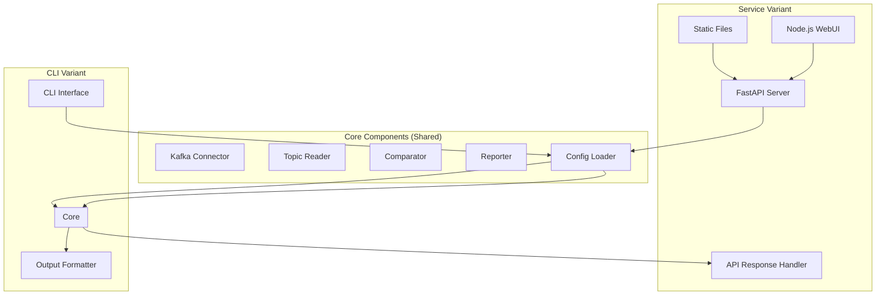
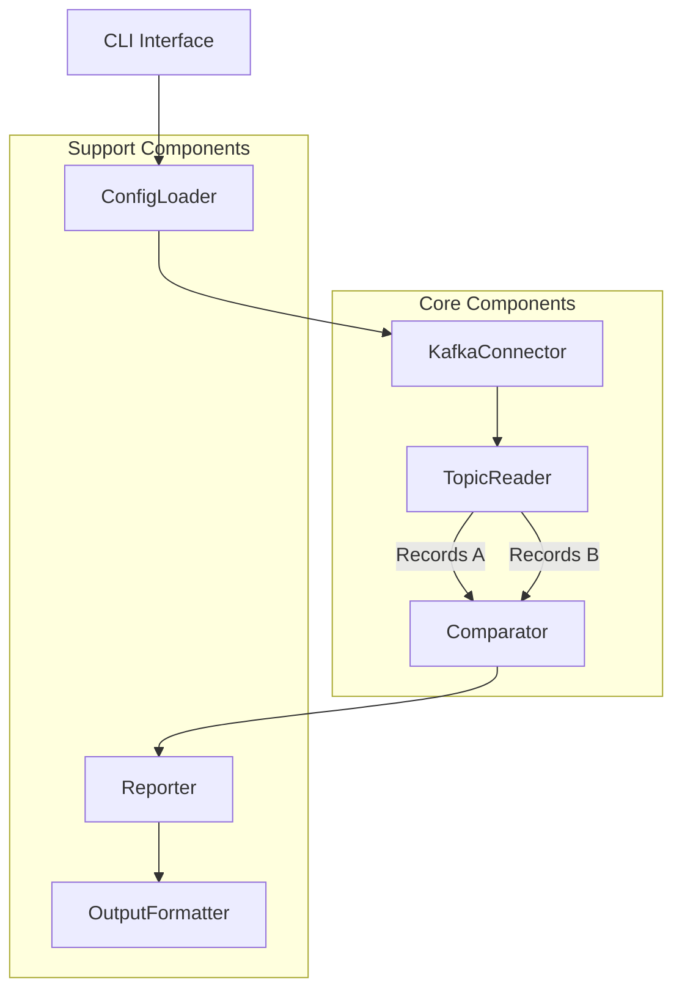

# KDIFF TOOL: INTERFACE & ARCHITECTURE PROPOSAL V2

## SITUATION ANALYSIS

- **Core problem**: Verify data consistency between two Kafka topics without file dumps
- **Key constraints**: 
  - Must handle binary-level comparison 
  - Must work directly with streams/tables
  - Must be configurable for different clusters
- **Critical variables**:
  - Message content equality (mandatory)
  - Offset/timestamp/schema-id equality (optional)
  - Reading boundaries (start/end offsets, timestamps, message count)

## INTERFACE DESIGN

### Command-line Interface

```
kdiff [OPTIONS] --topic-a TOPIC_A --topic-b TOPIC_B

Options:
  --cluster-a TEXT             Cluster A name from config (default: from env)
  --cluster-b TEXT             Cluster B name from config (default: same as cluster-a)
  --topic-a TEXT               Topic name on cluster A [required]
  --topic-b TEXT               Topic name on cluster B [required]
  --start-offset-a INTEGER     Starting offset for topic A (default: earliest)
  --start-offset-b INTEGER     Starting offset for topic B (default: earliest)
  --end-offset-a INTEGER       Ending offset for topic A (default: latest)
  --end-offset-b INTEGER       Ending offset for topic B (default: latest)
  --start-timestamp-a INTEGER  Starting timestamp for topic A (unix ms)
  --start-timestamp-b INTEGER  Starting timestamp for topic B (unix ms)
  --end-timestamp-a INTEGER    Ending timestamp for topic A (unix ms)
  --end-timestamp-b INTEGER    Ending timestamp for topic B (unix ms)
  --max-messages INTEGER       Maximum messages to compare
  --compare-content            Compare message content [default]
  --compare-offsets            Compare message offsets
  --compare-timestamps         Compare message timestamps
  --compare-schema-ids         Compare schema IDs if present
  --strategy [stream|table]    Comparison strategy (default: stream)
  --checksum-algorithm TEXT    Algorithm for checksums (default: SHA256)
  --output-format [text|json]  Output format (default: text)
  --config-dir PATH            Config directory (default: ~/ktools)
  --verbose                    Increase output verbosity
  --help                       Show this message and exit
```

### Service Interface (REST API)

```
/api/v1/clusters
  GET - List available clusters

/api/v1/topics
  GET - List topics for a cluster
  Parameters: ?cluster={cluster_name}

/api/v1/diff
  POST - Perform a diff operation
  Body: {
    "cluster_a": "cluster1",
    "topic_a": "topic1",
    "cluster_b": "cluster2", 
    "topic_b": "topic2",
    "start_offset_a": 0,
    "start_offset_b": 0,
    "end_offset_a": null,
    "end_offset_b": null,
    "max_messages": 1000,
    "comparison": {
      "content": true,
      "offsets": false,
      "timestamps": false,
      "schema_ids": false
    },
    "strategy": "stream",
    "checksum_algorithm": "SHA256"
  }

/api/v1/diff/{diff_id}
  GET - Retrieve results of a diff operation

/api/v1/status
  GET - Service health check
```

### Configuration Structure

```
~/ktools/
├── clusters/
│   ├── cluster-client-cfg-cluster-a
│   ├── cluster-client-cfg-cluster-b
│   └── ...
├── kdiff.yaml       # Global kdiff configuration
└── clusters.yaml    # Cluster aliases configuration
```

#### kdiff.yaml (Global Configuration)
```yaml
default:
  checksum_algorithm: "SHA256"
  output_format: "text"
  strategy: "stream"
  comparison:
    content: true
    offsets: false
    timestamps: false
    schema_ids: false
  max_messages: 1000

service:
  host: "0.0.0.0"
  port: 8080
  workers: 4
  log_level: "info"
  allow_origins: ["http://localhost:8080"]
```

#### clusters.yaml (Cluster Configuration)
```yaml
clusters:
  prod:
    config_file: "cluster-client-cfg-prod"
  dev:
    config_file: "cluster-client-cfg-dev"
  # Aliases for specific clusters
  cluster-a:
    config_file: "cluster-client-cfg-cluster-a"
  cluster-b:
    config_file: "cluster-client-cfg-cluster-b"
```

## ARCHITECTURE DESIGN

### Overall Architecture



### Core Architecture



### WebUI Components

The Node.js WebUI will be a single-page application with:

1. **Cluster Selection Panel**
   - Dropdown selectors for cluster A and B
   - Topic browsers for each cluster

2. **Comparison Configuration**
   - Input fields for start/end offsets or timestamps
   - Checkboxes for comparison options
   - Radio buttons for strategy selection

3. **Results View**
   - Summary statistics
   - Paginated message diff table
   - Visual indicators for differences
   - Export options (JSON, CSV)

4. **Admin Panel**
   - Service status monitoring
   - Configuration editor

### Key Components

1. **CLI Interface**: Processes command line arguments, validates inputs
2. **ConfigLoader**: Loads configurations from ~/ktools directory
3. **KafkaConnector**: Establishes connections to Kafka clusters
4. **TopicReader**: Reads messages from topics based on boundaries
5. **Comparator**: Implements comparison strategies (stream/table)
6. **Reporter**: Tracks differences and statistics
7. **OutputFormatter**: Formats results as text or JSON
8. **FastAPI Server**: Provides REST API for service variant
9. **WebUI**: Node.js-based frontend for interacting with the service

### Core Classes

```python
class KDiffConfig:
    # Loads and manages configuration

class KafkaConnector:
    # Handles Kafka connection and client setup
    def connect(self, cluster_name):
        # Connect to cluster using config

class TopicReader:
    # Reads messages from a topic
    def read_messages(self, topic, start, end, max_count=None):
        # Return message iterator

class StreamComparator:
    # Compares messages as ordered streams
    def compare(self, stream_a, stream_b, options):
        # Return comparison results

class TableComparator:
    # Compares messages as unordered collections
    def compare(self, messages_a, messages_b, options):
        # Return comparison results

class DiffReporter:
    # Reports differences
    def report(self, comparison_results, format="text"):
        # Generate and return report

class KDiffService:
    # FastAPI service implementation
    def start_server(self, host, port):
        # Start the API server
```

## EXECUTION FRAMEWORK

1. **Implementation Phases**:
   - Phase 1: Core functionality (stream comparison)
   - Phase 2: Table comparison strategy
   - Phase 3: CLI packaging and distribution
   - Phase 4: Service API implementation
   - Phase 5: WebUI development
   - Phase 6: Performance optimization

2. **Package Structure**:
```
kdiff/
├── __init__.py
├── core/
│   ├── __init__.py
│   ├── config.py         # Configuration management
│   ├── connector.py      # Kafka connection handling
│   ├── reader.py         # Topic reading logic
│   ├── comparator.py     # Comparison strategies
│   └── reporter.py       # Results reporting
├── cli/
│   ├── __init__.py
│   ├── main.py           # Command-line entry point
│   └── formatter.py      # CLI output formatting
├── service/
│   ├── __init__.py
│   ├── api.py            # FastAPI application
│   ├── routes/           # API endpoints
│   ├── models/           # Pydantic models
│   └── static/           # WebUI static files
│       ├── index.html
│       ├── css/
│       ├── js/
│       └── assets/
├── utils/                # Shared utility functions
└── tests/                # Test suite
```

3. **Deployment Package**:

### CLI Variant
- Python wheel package with setuptools
- Shell script wrapper for easy invocation
- Configuration in ~/ktools directory

### Service Variant
- Docker container for easy deployment
- Configuration via environment variables or config file
- FastAPI server hosting both API and static WebUI
- Development mode with auto-reload for UI changes

4. **Testing Strategy**:
   - Unit tests for each component
   - Integration tests with Docker Kafka instances
   - Performance benchmarks for large topics
   - End-to-end API tests
   - WebUI functional tests
