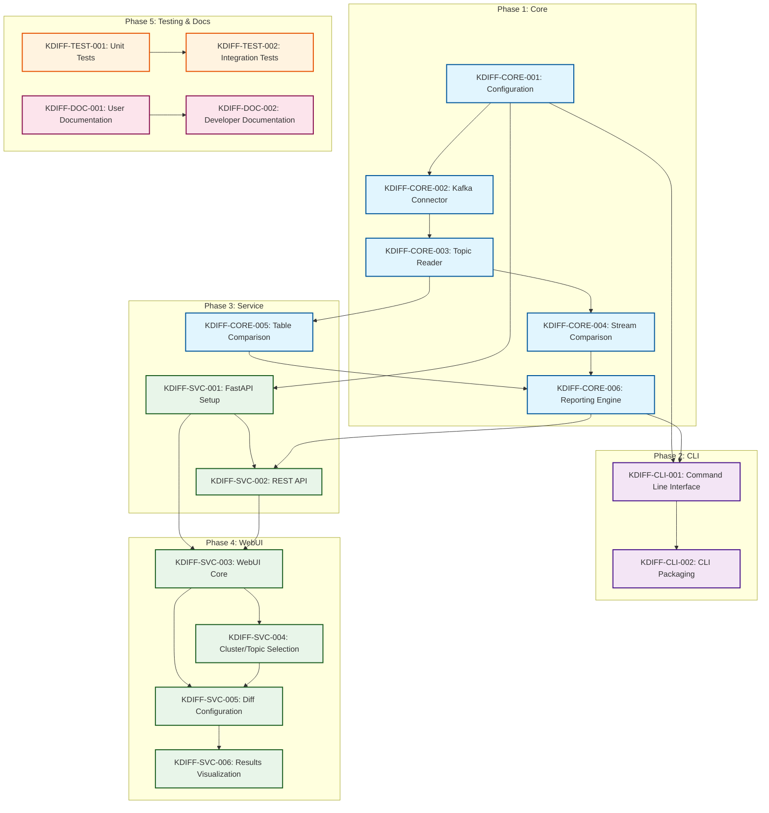

# KDIFF Implementation Work Plan

## Implementation Phases

The implementation is organized into the following phases, with each phase building upon the previous ones:

### Phase 1: Core Functionality
- **KDIFF-CORE-001**: Core Configuration Module (2 days)
- **KDIFF-CORE-002**: Kafka Connector Implementation (3 days)
- **KDIFF-CORE-003**: Topic Reader Implementation (4 days)
- **KDIFF-CORE-004**: Stream Comparison Strategy (4 days)
- **KDIFF-CORE-006**: Reporting Engine (3 days)

**Phase 1 Duration**: 16 days (some tasks can be parallelized)

### Phase 2: CLI Implementation
- **KDIFF-CLI-001**: Command Line Interface (3 days)
- **KDIFF-CLI-002**: CLI Packaging and Distribution (2 days)

**Phase 2 Duration**: 5 days

### Phase 3: Service Implementation
- **KDIFF-CORE-005**: Table Comparison Strategy (5 days)
- **KDIFF-SVC-001**: FastAPI Service Setup (3 days)
- **KDIFF-SVC-002**: REST API Endpoints Implementation (5 days)

**Phase 3 Duration**: 13 days (some tasks can be parallelized)

### Phase 4: WebUI Implementation
- **KDIFF-SVC-003**: WebUI - Core Framework (4 days)
- **KDIFF-SVC-004**: WebUI - Cluster/Topic Selection (3 days)
- **KDIFF-SVC-005**: WebUI - Diff Configuration (3 days)
- **KDIFF-SVC-006**: WebUI - Results Visualization (5 days)

**Phase 4 Duration**: 15 days (some tasks can be parallelized)

### Phase 5: Testing & Documentation
- **KDIFF-TEST-001**: Unit Test Suite (5 days)
- **KDIFF-TEST-002**: Integration Test Suite (6 days)
- **KDIFF-DOC-001**: User Documentation (4 days)
- **KDIFF-DOC-002**: Developer Documentation (4 days)

**Phase 5 Duration**: 19 days (some tasks can be parallelized)

## Dependency Graph

## Total Project Timeline

Based on the work plan, and assuming some parallelization where possible:

- **Total Development Time**: 45-50 working days (approximately 10 weeks)
- **Critical Path**: Core → CLI → Service → WebUI → Testing & Documentation

## Risk Areas and Mitigations

1. **Kafka Integration Complexity**
   - Risk: Integration with different Kafka versions and configurations might be challenging
   - Mitigation: Early prototyping of Kafka connector, thorough testing with multiple Kafka versions

2. **Performance with Large Topics**
   - Risk: Tool may experience performance issues with very large Kafka topics
   - Mitigation: Implement streaming comparison with pagination, optimize memory usage

3. **Browser Compatibility for WebUI**
   - Risk: WebUI may have inconsistent behavior across browsers
   - Mitigation: Use established frontend frameworks, implement cross-browser testing

4. **Security Concerns**
   - Risk: Service mode may expose sensitive data or configurations
   - Mitigation: Implement authentication, validate input, follow security best practices

5. **Deployment Complexity**
   - Risk: Deployment across different environments may be challenging
   - Mitigation: Container-based deployment, comprehensive documentation, simplified installation
